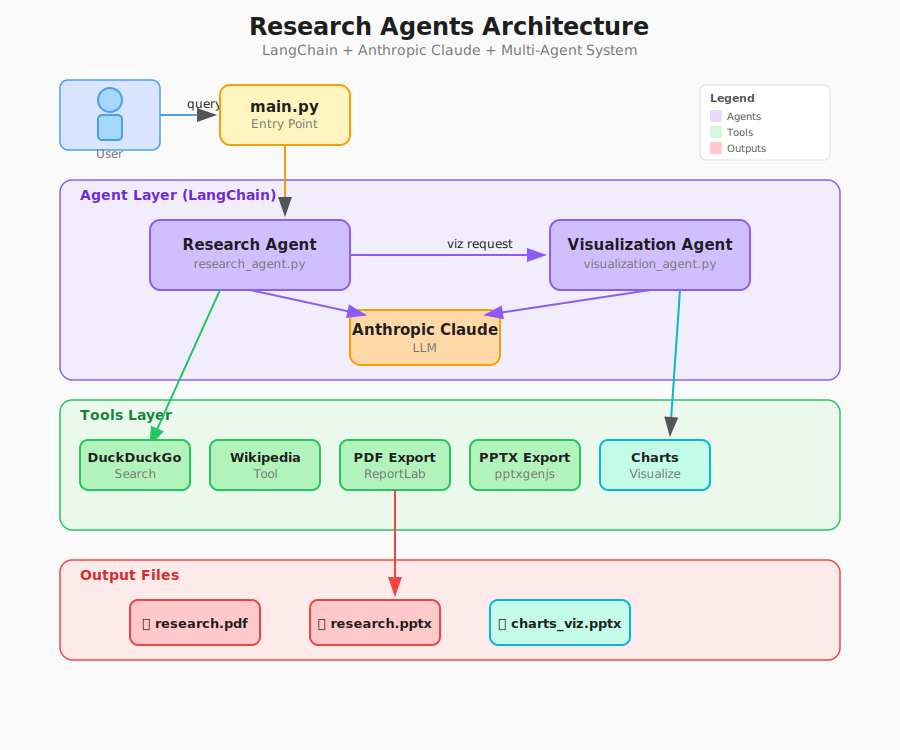

# Research Agents

AI-powered research assistant that generates comprehensive research reports with professional PDF and PowerPoint outputs. Built with LangChain and Claude (Anthropic).

## Features

- 🔍 Intelligent research using DuckDuckGo and Wikipedia
- 🤖 Adaptive AI (Claude Sonnet for speed, Opus for complex research)
- 📄 PDF report generation
- 📊 PowerPoint presentations with data visualizations
- 🎨 Multiple color themes (navy-teal, navy-gold, charcoal-blue)

## Architecture



The system uses a multi-agent architecture with LangChain orchestrating two specialized agents:
- **Research Agent**: Conducts research using web search and Wikipedia
- **Visualization Agent**: Creates data-driven presentations with charts

Both agents leverage Anthropic Claude for intelligent processing and have access to specialized tools for search, content retrieval, and file generation.

## Quick Start

### Prerequisites
- Python 3.11+
- Node.js
- Anthropic API key ([get one here](https://console.anthropic.com/))

### Installation

```bash
# Clone and navigate
git clone <repository-url>
cd research-agents

# Set up Python environment
python -m venv venv311
.\venv311\Scripts\activate  # Windows
# source venv311/bin/activate  # Linux/Mac

# Install dependencies
pip install -r requirements.txt
npm install

# Configure API key
echo "ANTHROPIC_API_KEY=your_key_here" > .env
```

### Run the Application

```bash
# Terminal 1 - Start API server
python main.py

# Terminal 2 - Start web UI
cd frontend
streamlit run streamlit_app.py
```

Open `http://localhost:8501` in your browser to use the web interface.

## Configuration

Create a `.env` file:
```env
ANTHROPIC_API_KEY=your_key_here
PORT=8000  # optional
```

Edit [`config/config.py`](config/config.py) to customize models, themes, and output paths.

## Themes

- **Navy-Teal**: Navy Blue & Teal (default)
- **Navy-Gold**: Navy Blue & Gold (elegant)
- **Charcoal-Blue**: Charcoal & Blue (corporate)

## Troubleshooting

- **API won't start**: Check `.env` has valid `ANTHROPIC_API_KEY` and port 8000 is free
- **Streamlit can't connect**: Ensure API server is running on port 8000
- **PowerPoint fails**: Verify Node.js is installed (`node --version`)
- **No results**: Check internet connection and API key validity

## License

MIT License

## Contributing

Contributions welcome! Fork, create a feature branch, commit, push, and open a Pull Request.

---

Built with LangChain and Claude AI